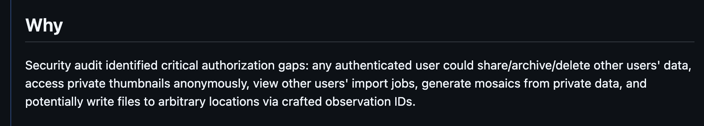
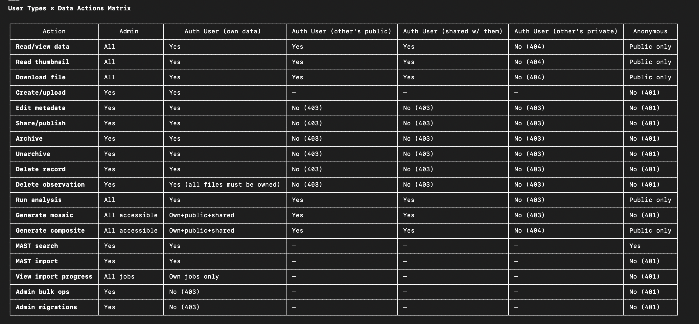
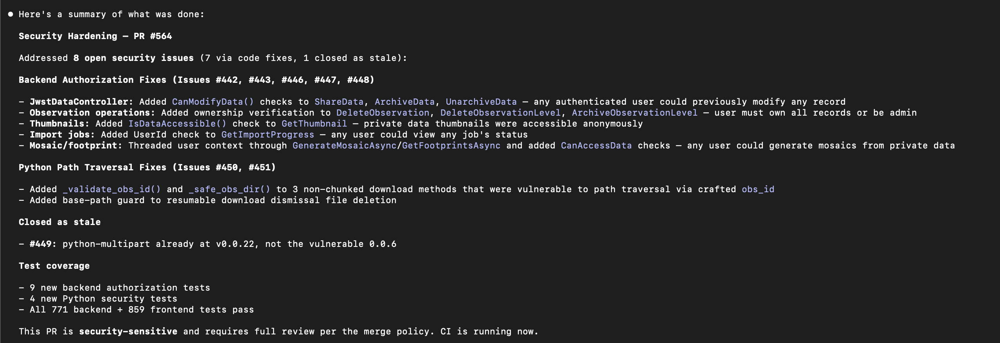
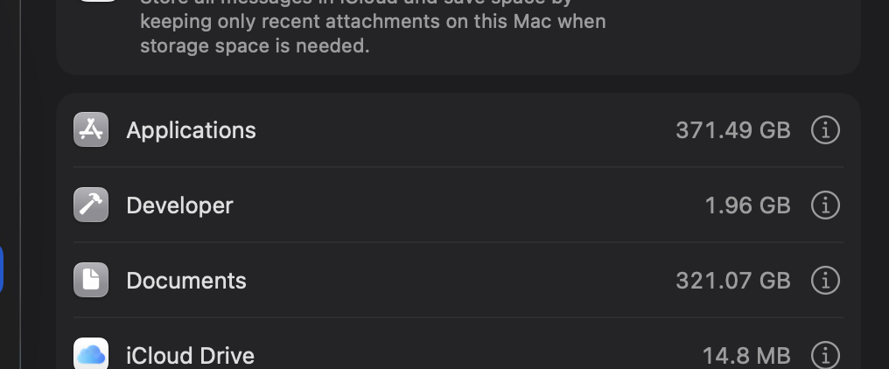
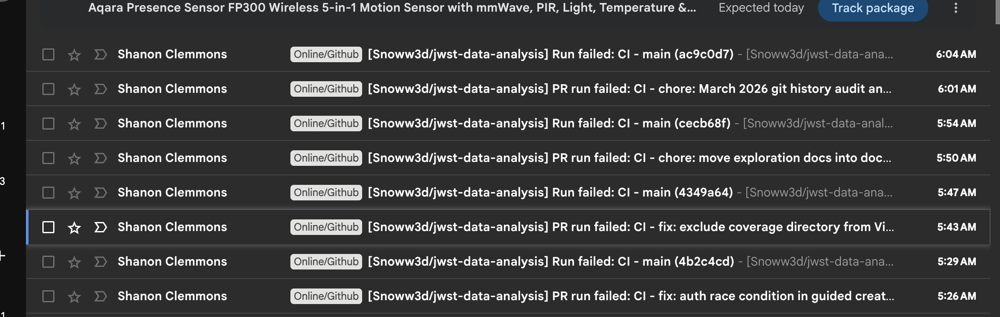

---
date:
  created: 2026-03-02
categories:
  - Maintenance
  - Bug Fix
tags:
  - auth
  - e2e-tests
  - export
  - guided-wizard
  - security
  - viewer
authors:
  - shanon
---

# Session: March 2, 2026

<!-- enriched -->

Productive session with 7 pull requests: 5 fixes, 2 maintenance. Security hardening across the stack.

<!-- more -->

## Developer Journal

The anonymous access changes from last session's friend feedback exposed deeper auth issues. MAST data should be considered public — who can delete it needed to be addressed, and the guided flow was gating too much behind login. Correcting that opened a cascade of authorization gaps that had been lurking.

The security PR required a full manual review — shared screenshots of the endpoint authorization table to track what was covered. Found issues that already had open GitHub issues, so the fix closed a batch of them at once.

Had to fight Docker Desktop disk space issues early in the session — it got into a deadlock where it needed space to start but needed to start to free space. Had to uninstall Baldur's Gate 3 from the laptop to free up 160GB. Shared a screenshot of the storage breakdown — the project documents and BG3 were the two biggest consumers.

E2E tests were temporarily broken from the rapid auth changes. Adopted a pragmatic approach: let them break during feature churn and fix them once things settle, since requiring green E2E for every PR slows down rapid iteration. They run on every PR but aren't a merge gate.

Also experimented with the Claude Chrome extension for a code review task — it took about 30 minutes instead of the expected 2, but ran unattended in a background tab. Getting faster but not quite useful yet.

Later in the afternoon, deployed the project's session blog to GitHub Pages and shared the URL publicly for the first time. The blog is auto-generated from GitHub PR data and enriched with Slack journal entries — took significant effort to work out the generation and enrichment workflows, but v1 shipped despite a known date header bug. Hit Claude's 32K output token limit during one of the blog generation runs, a sign of how much data was being processed.

## Highlights

### [#559](https://github.com/Snoww3d/jwst-data-analysis/pull/559) auth race condition in guided create when all data cached

Fixes auth race condition in the guided create wizard that caused E2E test failures and would affect real users when all FITS data is already cached.

*When all FITS data for a recipe is already cached (no downloads needed), `startProcessing()` was called immediately during `resolveRecipe` — before `useAuth()` had loaded `isAuthenticated` from localS...*

### [#573](https://github.com/Snoww3d/jwst-data-analysis/pull/573) add missing authorization checks for issues #565-#570

Adds missing authorization checks across 6 endpoints in MastController and DataManagementController, closing all remaining authorization gap issues from the security model review.

*The security model audit (PR #564) identified 7 authorization gaps where authenticated users could access or modify other users' data. Issue #572 was fixed in that PR; this PR resolves the remaining 6...*

## What Changed

### Bug Fixes (5)

- [#559](https://github.com/Snoww3d/jwst-data-analysis/pull/559) auth race condition in guided create when all data cached
- [#560](https://github.com/Snoww3d/jwst-data-analysis/pull/560) exclude coverage directory from Vite file watcher
- [#563](https://github.com/Snoww3d/jwst-data-analysis/pull/563) resolve E2E test failures in viewer, export, and auth refresh
- [#564](https://github.com/Snoww3d/jwst-data-analysis/pull/564) add missing authorization checks across backend and processing engine
- [#573](https://github.com/Snoww3d/jwst-data-analysis/pull/573) add missing authorization checks for issues #565-#570

### Maintenance (2)

- [#561](https://github.com/Snoww3d/jwst-data-analysis/pull/561) move exploration docs into docs/plans/exploration/
- [#562](https://github.com/Snoww3d/jwst-data-analysis/pull/562) March 2026 git history audit and audit folder structure

## Issues

**Opened:**

- [#565](https://github.com/Snoww3d/jwst-data-analysis/issues/565) — fix: DataManagementController.Search omits SharedWith from access filter
- [#566](https://github.com/Snoww3d/jwst-data-analysis/issues/566) — fix: MAST import resume endpoint lacks ownership check
- [#567](https://github.com/Snoww3d/jwst-data-analysis/issues/567) — fix: resumable downloads endpoint returns all users' jobs
- [#568](https://github.com/Snoww3d/jwst-data-analysis/issues/568) — fix: resumable download dismiss endpoint lacks ownership check
- [#569](https://github.com/Snoww3d/jwst-data-analysis/issues/569) — fix: refresh-metadata endpoints lack ownership check
- [#570](https://github.com/Snoww3d/jwst-data-analysis/issues/570) — fix: export download endpoint lacks ownership check on export files
- [#571](https://github.com/Snoww3d/jwst-data-analysis/issues/571) — refactor: deduplicate IsDataAccessible between AnalysisController and JwstDataController
- [#572](https://github.com/Snoww3d/jwst-data-analysis/issues/572) — feat: allow anonymous mosaic generation for public data (guided wizard)

**Closed:**

- [#442](https://github.com/Snoww3d/jwst-data-analysis/issues/442) — security: missing CanModifyData checks on mutation endpoints (IDOR)
- [#443](https://github.com/Snoww3d/jwst-data-analysis/issues/443) — security: destructive observation-wide operations not owner/admin-gated
- [#446](https://github.com/Snoww3d/jwst-data-analysis/issues/446) — security: private thumbnail access bypass via AllowAnonymous
- [#447](https://github.com/Snoww3d/jwst-data-analysis/issues/447) — security: import-job endpoints not bound to requesting user
- [#448](https://github.com/Snoww3d/jwst-data-analysis/issues/448) — security: mosaic/analysis endpoints lack per-object authorization (cross-tenant IDOR)
- [#449](https://github.com/Snoww3d/jwst-data-analysis/issues/449) — security: python-multipart pinned at vulnerable version 0.0.6
- [#450](https://github.com/Snoww3d/jwst-data-analysis/issues/450) — security: path traversal in non-chunked MAST download (obs_id in filesystem path)
- [#451](https://github.com/Snoww3d/jwst-data-analysis/issues/451) — security: resumable dismissal can delete paths without base-path guard
- [#565](https://github.com/Snoww3d/jwst-data-analysis/issues/565) — fix: DataManagementController.Search omits SharedWith from access filter
- [#566](https://github.com/Snoww3d/jwst-data-analysis/issues/566) — fix: MAST import resume endpoint lacks ownership check
- [#567](https://github.com/Snoww3d/jwst-data-analysis/issues/567) — fix: resumable downloads endpoint returns all users' jobs
- [#568](https://github.com/Snoww3d/jwst-data-analysis/issues/568) — fix: resumable download dismiss endpoint lacks ownership check
- [#569](https://github.com/Snoww3d/jwst-data-analysis/issues/569) — fix: refresh-metadata endpoints lack ownership check
- [#570](https://github.com/Snoww3d/jwst-data-analysis/issues/570) — fix: export download endpoint lacks ownership check on export files
- [#572](https://github.com/Snoww3d/jwst-data-analysis/issues/572) — feat: allow anonymous mosaic generation for public data (guided wizard)

---
10 commits across 7 pull requests.
*Latest session.*
