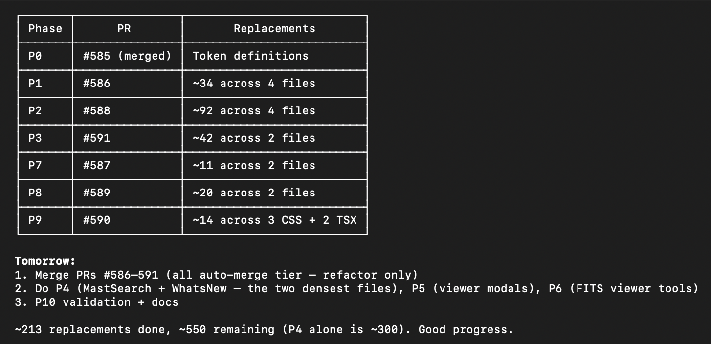
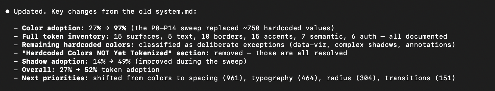
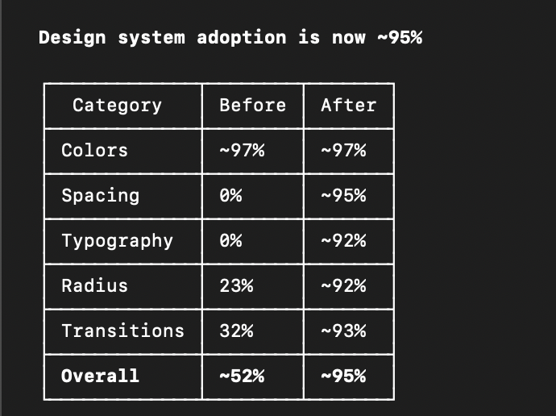

---
date:
  created: 2026-03-03
categories:
  - Development
tags:
  - auth
  - frontend
  - mast-data
  - viewer
authors:
  - shanon
---

# March 3: The Intern's First Day

<!-- enriched -->

Early development — 22 commits before the PR workflow was established.

<!-- more -->

## Developer Journal

Up at 5am with a Starbucks, watching the "intern" work. The style guide token system had been added mid-project, so newer components used design tokens while older ones still had their original — perfectly correct — hardcoded hex values. The kind of tech debt that never gets prioritized because it's not broken, just inconsistent. On a real team you might hand this to a new hire as an onboarding task that doubles as a codebase tour, since they'd have to read every CSS file looking for needles. So the AI agent got assigned exactly that role, with the accumulated guardrails and rules built up over weeks of back-and-forth. It wasn't hard work to set up — just iterative discussion about standards and trust levels.

The migration ran through the entire day across 22 PRs, tokenizing colors in wizard CSS, viewer modals, FITS viewer panels, dashboard components, auth pages, composite and mosaic steps, comparison tools, and more. The `sed` commands flying through the terminal were replacing `rgba(239, 68, 68, 0.3)` with `var(--border-error)` and similar transformations across dozens of files. By mid-morning the color migration was complete and looking good. The payoff beyond consistency: theming will be straightforward in the future since every color now routes through CSS custom properties.

Later, a friend asked whether Claude Code could handle projects split across multiple repos. That turned into an impromptu discussion on monorepos.

## Commits

- `b08b6d9` refactor: consolidate button padding to 3 tiers (P19.3) (#607)
- `ed4328c` refactor: add .btn-base shared button class (P19.1 + P19.2) (#606)
- `531c0ad` refactor: standardize button patterns and replace hardcoded white (P18) (#605)
- `d337f6b` refactor: audit and migrate remaining design token violations (P17) (#604)
- `9c0ec75` fix: add missing btn-action styles to ChannelAssignStep (#603)
- `3bb5b9a` refactor: align UI consistency outliers across buttons, badges, shadows, and toolbars (#602)
- `3671797` refactor: migrate spacing, typography, radius, and transition values to design tokens (P16) (#601)
- `0248e87` feat: add radius-xs and radius-full tokens for upcoming radius migration (#600)
- `d2038c4` refactor: add semantic border tokens and replace error/warning/aqua border colors (P14) (#599)
- `a83dc39` refactor: replace hardcoded colors with design tokens in wizard CSS (P11) (#598)
- `5939f83` refactor: replace hardcoded colors with design tokens in viewer and tool CSS (P12) (#597)
- `ceb1926` refactor: replace hardcoded colors with design tokens in component and page CSS (P13) (#596)
- `538892c` feat: extend design token palette with canvas, panel, and aqua tokens (#595)
- `8fb1f14` refactor: replace hardcoded colors with design tokens in FITS viewer and tool panel CSS (#594)
- `03bb3f6` refactor: replace hardcoded colors with design tokens in viewer modal CSS (#593)
- `d2c9cf5` refactor: tokenize MastSearch and WhatsNewPanel CSS colors (#592)
- `a5d810c` feat: tokenize mosaic wizard step CSS (P3) (#591)
- `452cf64` feat: tokenize AuthPages CSS + auth sweep (P9) (#590)
- `09d8399` feat: tokenize comparison + region CSS (P8) (#589)
- `6053f92` feat: tokenize composite wizard step CSS (P2) (#588)
- `4d4efd9` feat: tokenize DataCard and dashboard CSS (P7) (#587)
- `3cddd64` feat: tokenize wizard shell and stepper CSS (P1) (#586)

---
22 commits.
*Latest session.*
