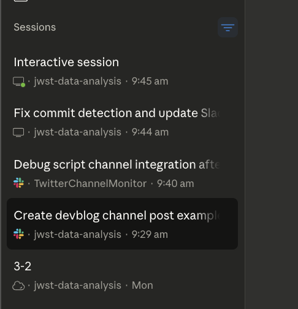
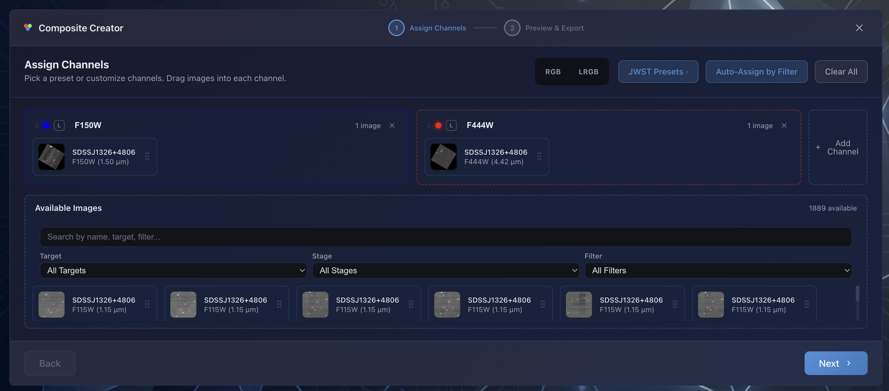
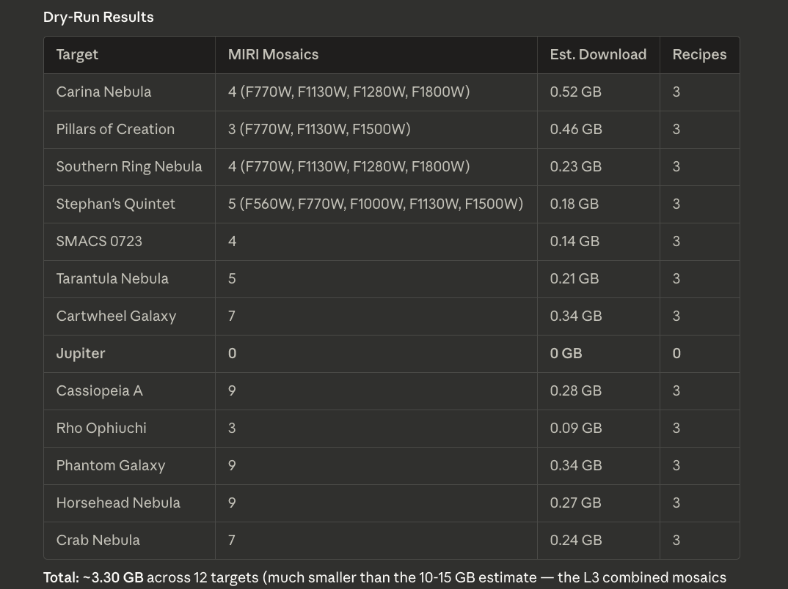
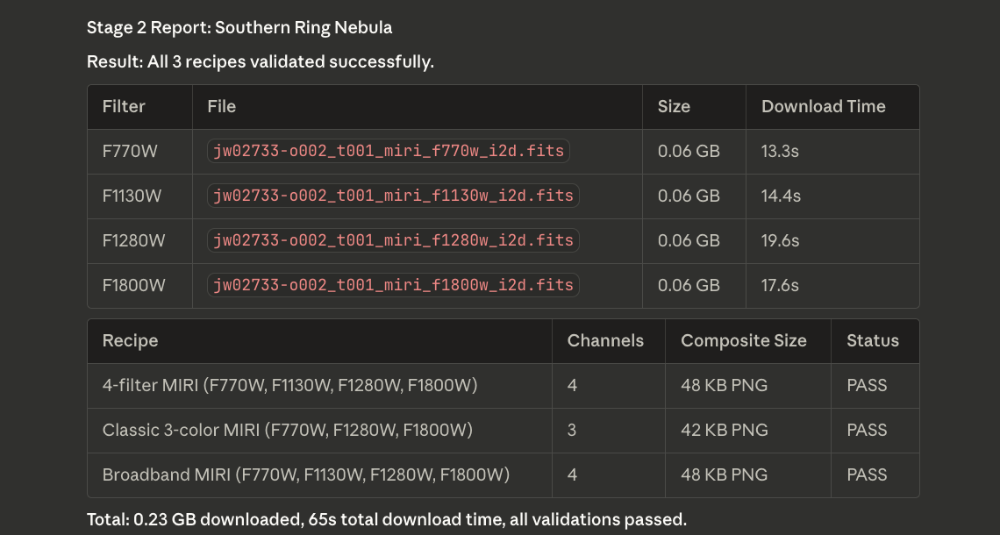
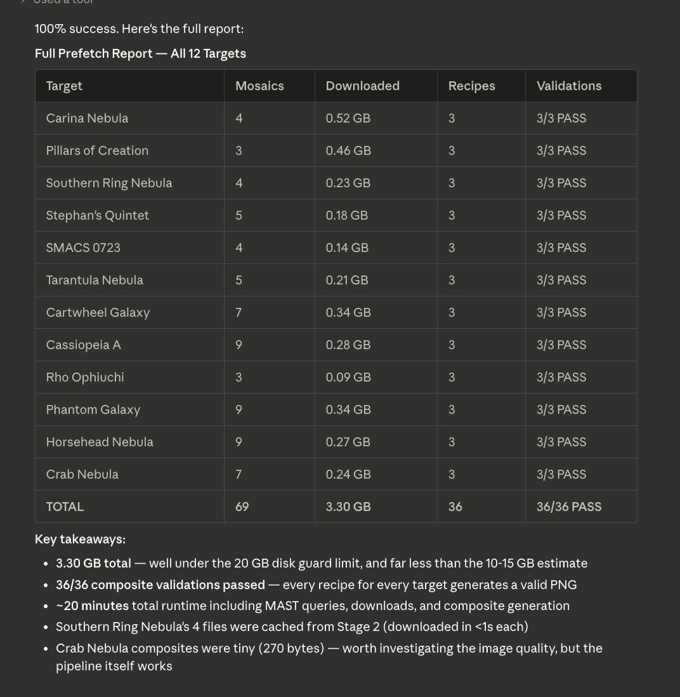

---
date:
  created: 2026-03-04
categories:
  - Maintenance
  - Documentation
  - Feature
  - Bug Fix
  - Refactoring
tags:
  - ci
  - deployment
  - docs
  - guided-wizard
  - imaging
  - infrastructure
authors:
  - shanon
---

# March 4: Signal From Noise

<!-- enriched -->

A marathon session: 19 pull requests merged (7 features, 7 fixes, 2 docs, 1 refactor, 2 maintenance) plus a full roadmap restructure and codebase security audit. Major work on the composite imaging pipeline, then project management in the evening.

<!-- more -->

## Developer Journal

Decided to give the devblog its own space. Previously, the development musings were scattered across the programming channel, mixed in with general tech discussions. That worked fine when the project was just getting started, but as the blog generation pipeline matured, it made sense to separate signal from noise. The new channel is purpose-built: everything posted there feeds directly into the blog. Claude reads the channel, synthesizes the discussions, and generates narrative posts — not a list of facts, but a story. Obsidian is wired up for direct editing before anything goes live, so the occasional joke from friends gets filtered out manually. Or maybe it doesn't, depending on whether it adds narrative value. Also fixed the generation scripts to detect commits across all branches, not just main — otherwise days with only unmerged feature branch work showed zero commits.

The real technical focus was on two fronts. First, bicolor compositing: figuring out how to produce convincing false-color images from just two filters by synthesizing a green channel from the red and blue data. The math for generating that synthetic middle channel while preserving detail and depth was the morning's deep work. Second, the discovery page got a round of caching and prefetch improvements — localStorage with LRU eviction for recipe suggestions, and a validation script to test all the featured discovery recipes against the live MAST API on staging.

Running that validation script on AWS surfaced some real issues. NIRCam had to be excluded from the test run because the file sizes would have destroyed the staging server's storage — a reminder that the tiered S3/EBS storage feature is overdue. The MIRI-only run exposed cross-instrument recipes ranking too high despite resolution mismatches, and NIRCam compound filter names breaking the prefetch. Both got fixed in the same session. Shared the results with friends, acknowledging that some NIRCam recipes still have known issues even though the validation output looked clean.

Later in the day, the library page got instrument filtering — first as a flat dropdown, then upgraded to a grouped tree structure matching how JWST instruments actually work (MIRI/IMAGE, NIRCAM/CORON, etc.), plus color-coded instrument badges on every file card. Wrapped up with a quick design system cleanup, standardizing the last two hardcoded 30px icon buttons into the shared `.btn-icon-sm` class.

The evening session shifted to project management. The development roadmap had grown to 711 lines — 280 of 318 items checked off, mostly historical noise. Restructured it into a slim 154-line strategy doc with three forward-looking phases (Production Readiness, Observability, Polish & Community Release) and archived Phases 1–5 into a separate file. Created 13 new GitHub issues for roadmap items that had never been tracked, added `phase:6/7/8` labels to all 39 open issues, and finally got the roadmap and issue tracker in sync. Then ran a codebase audit that surfaced 11 pre-Phase 6 issues — auth race conditions, silent error swallowing, hardcoded timeouts, and four security issues that were actively leaking information on the staging server. Shut down staging until those are fixed. Tomorrow's agenda: harden auth, patch the security leaks, bring staging back up clean.

## Highlights

### [#632](https://github.com/Snoww3d/jwst-data-analysis/pull/632) deprioritize cross-instrument composite recipes

Improve recipe engine output quality by deprioritizing cross-instrument recipes and eliminating duplicate suggestions.

*Two issues found during NIRCam prefetch validation: 1. Cross-instrument recipes (MIRI+NIRCam) were ranked #1 despite resolution mismatches (NIRCam ~0.03"/px vs MIRI ~0.11"/px) and FOV differences 2. W...*

### [#620](https://github.com/Snoww3d/jwst-data-analysis/pull/620) allow composite auto-assign with 2 selected images

Fix composite wizard opening with empty channels when only 2 images are selected from the dashboard.

*The `computeChannels` gate in `CompositePage.tsx` required `>= 3` images for auto-assignment, so selecting 2 images and clicking "Composite (2)" opened the wizard with empty RGB channels instead of as...*

## What Changed

### Features (7)

- [#616](https://github.com/Snoww3d/jwst-data-analysis/pull/616) pass recipe via Router state to skip redundant API calls
- [#618](https://github.com/Snoww3d/jwst-data-analysis/pull/618) add localStorage caching for searchByTarget and suggestRecipes
- [#619](https://github.com/Snoww3d/jwst-data-analysis/pull/619) add LRU eviction and cache stats to localStorage cache
- [#621](https://github.com/Snoww3d/jwst-data-analysis/pull/621) bicolor compositing with synthetic green for 2-filter cases
- [#626](https://github.com/Snoww3d/jwst-data-analysis/pull/626) add selective discovery prefetch & validation script
- [#630](https://github.com/Snoww3d/jwst-data-analysis/pull/630) add instrument filter and badges to library page
- [#631](https://github.com/Snoww3d/jwst-data-analysis/pull/631) group instrument filter by JWST instrument with mode sub-options

### Bug Fixes (7)

- [#615](https://github.com/Snoww3d/jwst-data-analysis/pull/615) show partial download failures as warnings instead of blocking errors
- [#620](https://github.com/Snoww3d/jwst-data-analysis/pull/620) allow composite auto-assign with 2 selected images
- [#625](https://github.com/Snoww3d/jwst-data-analysis/pull/625) redirect to discovery page after sign out
- [#628](https://github.com/Snoww3d/jwst-data-analysis/pull/628) remove Jupiter from featured targets
- [#629](https://github.com/Snoww3d/jwst-data-analysis/pull/629) handle NIRCam compound filter names in prefetch discovery
- [#632](https://github.com/Snoww3d/jwst-data-analysis/pull/632) deprioritize cross-instrument composite recipes
- [#634](https://github.com/Snoww3d/jwst-data-analysis/pull/634) include all branches in git log for devblog commit detection

### Refactoring (1)

- [#633](https://github.com/Snoww3d/jwst-data-analysis/pull/633) standardize 30px icon buttons with .btn-icon-sm class

### Documentation (2)

- [#623](https://github.com/Snoww3d/jwst-data-analysis/pull/623) add deploy workflow review to Phase 7 roadmap
- [#653](https://github.com/Snoww3d/jwst-data-analysis/pull/653) restructure development roadmap into slim 3-phase strategy

### Maintenance (2)

- [#622](https://github.com/Snoww3d/jwst-data-analysis/pull/622) deploy from staging branch instead of main
- [#624](https://github.com/Snoww3d/jwst-data-analysis/pull/624) add .obsidian and output to .gitignore, commit exploration doc

## Issues

**Opened:**

- [#617](https://github.com/Snoww3d/jwst-data-analysis/issues/617) — feat: add localStorage caching for searchByTarget and suggestRecipes
- [#627](https://github.com/Snoww3d/jwst-data-analysis/issues/627) — fix: Jupiter target fails MAST resolution (solar system object)
- [#640](https://github.com/Snoww3d/jwst-data-analysis/issues/640)–[#652](https://github.com/Snoww3d/jwst-data-analysis/issues/652) — 13 roadmap issues (H-series email, O-series observability, admin dashboard, infrastructure)
- [#654](https://github.com/Snoww3d/jwst-data-analysis/issues/654)–[#660](https://github.com/Snoww3d/jwst-data-analysis/issues/660) — 7 pre-Phase 6 bugs (auth hardening, API client, SignalR timeout, stale stubs)

**Closed:**

- [#609](https://github.com/Snoww3d/jwst-data-analysis/issues/609) — refactor: standardize 30px icon buttons (.comparison-zoom-btn, .result-rotate-btn) to btn-icon
- [#617](https://github.com/Snoww3d/jwst-data-analysis/issues/617) — feat: add localStorage caching for searchByTarget and suggestRecipes
- [#627](https://github.com/Snoww3d/jwst-data-analysis/issues/627) — fix: Jupiter target fails MAST resolution (solar system object)

---
35 commits across 19 pull requests.
*Latest session.*
