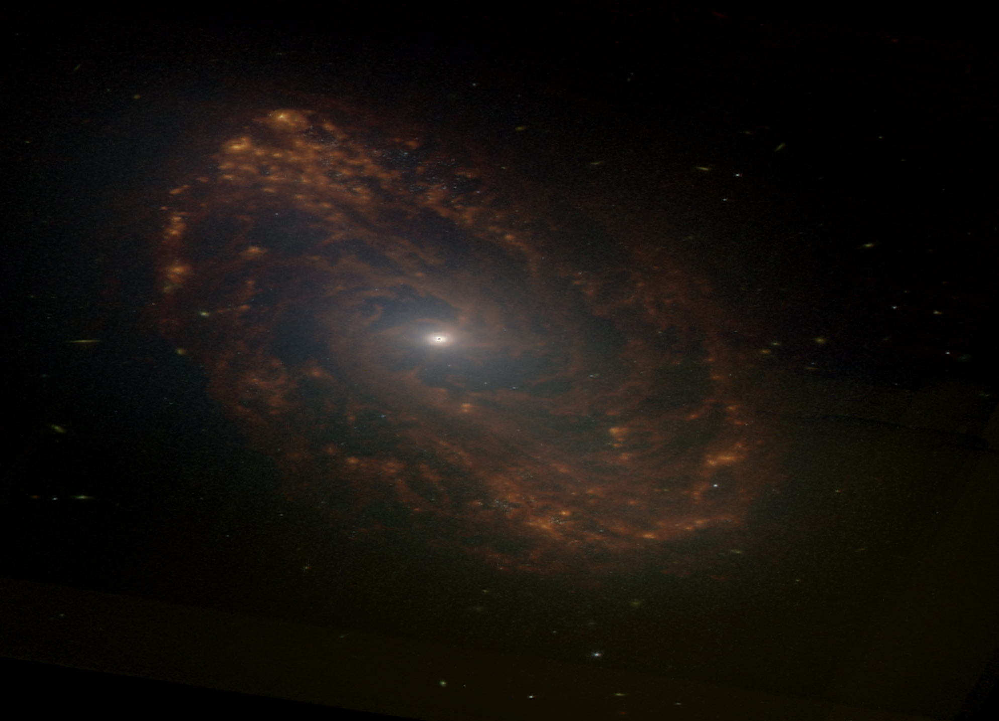

---
date:
  created: 2026-03-05
categories:
  - Maintenance
  - Bug Fix
  - Feature
  - Documentation
tags:
  - ci
  - process
  - code-quality
  - mast
  - compositing
authors:
  - shanon
---

# March 5: The Gap

<!-- enriched -->

A slower day between interview prep and wrapping up Phase 5. Four pull requests merged — process cleanup, lint fixes, and a small feature — but the real thread was confronting the quality gap between our composite output and NASA press images.

<!-- more -->

## Developer Journal

Started the morning expecting a light day. Interviews later, Phase 5 wrapping up, not much energy for deep feature work. But then a JWST ["space photo of the day"](https://www.space.com/astronomy/james-webb-space-telescope/spectacular-spiral-galaxy-revealed-by-james-webb-space-telescope-space-photo-of-the-day-for-march-4-2026) showed up — a spectacular spiral galaxy composited from eight wavelengths across both MIRI and NIRCam, taken back in June 2024 and only now reaching the public. The kind of image that makes you stop scrolling.

*NGC 5134 — the JWST "space photo of the day" that started the compositing quality conversation. Credit: NASA/ESA/CSA/STScI*

The reaction was immediate and honest: "oh look, another image I can't quite reproduce." The gap between what NASA's imaging team produces and what our pipeline currently outputs is real, and it's not a small gap. The per-channel adjustments, the luminance blending, the sharpening — they're doing things we technically support but don't make easy or default to. Acknowledged that this is genuinely a hard problem, especially coming in with zero prior knowledge of astronomical image processing. The seed for a dedicated compositing quality spike was planted here — it would become issue #680 the next day.

The actual code work was lighter. Slimmed the PR template from 51 lines to 28 — the old template was built for a multi-contributor team that doesn't exist at the pr level anymore but built into the cli with /teams now, so the redundant sections (type of change duplicating the title prefix, quality checklist duplicating CI) got cut. Added `perf` and `ci` as valid prefixes. Cleaned up all frontend lint warnings (two non-null assertions) and Python test warnings (AsyncMock coroutine issues, unclosed aiohttp sessions). Added a Release Date column to MAST search results — the field was already in the API response and TypeScript types, just never displayed. A friend suggested reaching out to NASA directly for white papers or technical details on their imaging pipeline, which got a laugh but isn't actually a bad idea.

## What Changed

### Features (1)

- [#664](https://github.com/Snoww3d/jwst-data-analysis/pull/664) add Release Date column to MAST search results table

### Bug Fixes (1)

- [#663](https://github.com/Snoww3d/jwst-data-analysis/pull/663) resolve lint warnings and test warnings

### Maintenance (1)

- [#662](https://github.com/Snoww3d/jwst-data-analysis/pull/662) slim PR template and add perf/ci prefixes

### Documentation (1)

- [#661](https://github.com/Snoww3d/jwst-data-analysis/pull/661) update March 4 blog post with evening session work

---
4 commits across 4 pull requests.
