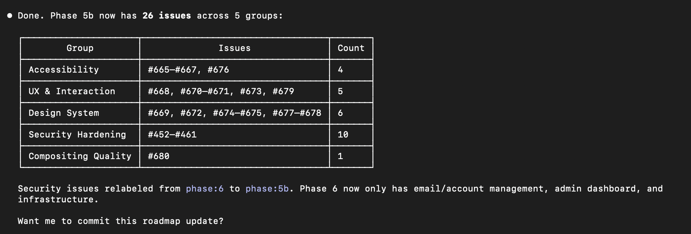
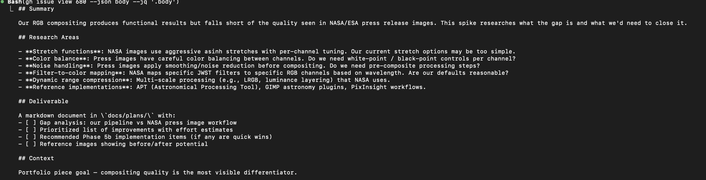
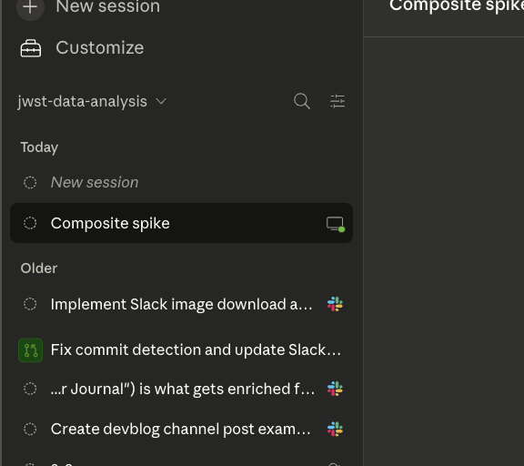

---
date:
  created: 2026-03-06
categories:
  - Maintenance
  - Documentation
  - Feature
  - Refactoring
tags:
  - astronomy-data
  - docs
  - guided-wizard
  - imaging
  - security
  - viewer
authors:
  - shanon
---

# March 6: Laying Groundwork

<!-- enriched -->

Phase 5b kicks off with a roadmap restructure, a full semantic search feature across all three stacks, and the start of a compositing quality spike. Nine pull requests merged — two features, five docs, one refactor, one maintenance.

<!-- more -->

## Developer Journal

Made the roadmap addition to create a Phase 5b — UI/UX polish, compositing improvements, and security hardening. The security issues aren't major, but they're technically there — if someone found the server IP (since the staging script sometimes deploys to AWS), those need addressing. Pulled those into tracked issues.

Started the compositing spike. This will probably need to split into different topics for learning — per-channel adjustments, luminance blending, sharpening, noise reduction. The gap between what NASA produces and what our pipeline outputs is real, and closing it means understanding each piece individually.

The big feature of the day was FITS semantic search — a full RAG pipeline across all three stacks. Users can now search their library with natural language queries like "long exposure NIRCam images of nebulae" and get ranked results with relevance scores. The system embeds structured FITS metadata as natural language prose using sentence-transformers, stores vectors in MongoDB, and does cosine similarity search. It's the kind of feature that makes the app feel genuinely useful rather than just a viewer.

Also had an amusing moment with Claude Desktop — session confusion issues on Wednesday, then the whole UX changed by Friday. Is it better? Maybe.

Cleaned up dead code from Phase 3 placeholder endpoints and extracted shared stretch types from the composite and mosaic wizards into a single module. Documentation got a pass too — fixed stale docs across the project and enriched earlier blog posts.

## What Changed

### Features (2)

- [#689](https://github.com/Snoww3d/jwst-data-analysis/pull/689) add composite presets and optimize stretch defaults
- [#699](https://github.com/Snoww3d/jwst-data-analysis/pull/699) add FITS semantic search (RAG) across all 3 stacks

### Refactoring (1)

- [#692](https://github.com/Snoww3d/jwst-data-analysis/pull/692) extract shared stretch types from composite and mosaic wizards

### Documentation (5)

- [#681](https://github.com/Snoww3d/jwst-data-analysis/pull/681) add Phase 5b (UI/UX polish, security, compositing) to roadmap
- [#693](https://github.com/Snoww3d/jwst-data-analysis/pull/693) add March 5 blog post
- [#694](https://github.com/Snoww3d/jwst-data-analysis/pull/694) add NASA NGC 5134 image to March 5 blog post
- [#695](https://github.com/Snoww3d/jwst-data-analysis/pull/695) fix stale documentation across project
- [#702](https://github.com/Snoww3d/jwst-data-analysis/pull/702) update March 3 and March 5 blog post text

### Maintenance (1)

- [#682](https://github.com/Snoww3d/jwst-data-analysis/pull/682) remove Phase 3 placeholder endpoints and dead processing UI

## Issues

**Opened:**

- [#665](https://github.com/Snoww3d/jwst-data-analysis/issues/665) — fix: add focus-visible states to all interactive elements
- [#666](https://github.com/Snoww3d/jwst-data-analysis/issues/666) — fix: standardize disabled state styling across components
- [#667](https://github.com/Snoww3d/jwst-data-analysis/issues/667) — fix: instrument badge contrast failures (WCAG AA)
- [#668](https://github.com/Snoww3d/jwst-data-analysis/issues/668) — fix: replace all alert() calls with toast notifications
- [#669](https://github.com/Snoww3d/jwst-data-analysis/issues/669) — refactor: standardize button variants into clear hierarchy
- [#670](https://github.com/Snoww3d/jwst-data-analysis/issues/670) — feat: add empty state for dashboard card list
- [#671](https://github.com/Snoww3d/jwst-data-analysis/issues/671) — fix: improve navigation wayfinding (active state, page titles)
- [#672](https://github.com/Snoww3d/jwst-data-analysis/issues/672) — fix: improve spacing in toolbar and card headers
- [#673](https://github.com/Snoww3d/jwst-data-analysis/issues/673) — fix: composite/mosaic ready state too subtle
- [#674](https://github.com/Snoww3d/jwst-data-analysis/issues/674) — fix: migrate hardcoded colors to design tokens
- [#675](https://github.com/Snoww3d/jwst-data-analysis/issues/675) — fix: inconsistent badge/status border treatment
- [#676](https://github.com/Snoww3d/jwst-data-analysis/issues/676) — fix: add focus-visible states to cards for keyboard users
- [#677](https://github.com/Snoww3d/jwst-data-analysis/issues/677) — fix: UserMenu dropdown blends into dark background
- [#678](https://github.com/Snoww3d/jwst-data-analysis/issues/678) — fix: WizardStepper mobile spacing
- [#679](https://github.com/Snoww3d/jwst-data-analysis/issues/679) — fix: improve archive action feedback
- [#680](https://github.com/Snoww3d/jwst-data-analysis/issues/680) — spike: research compositing pipeline to match NASA press image quality
- [#683](https://github.com/Snoww3d/jwst-data-analysis/issues/683) — feat: expose unsharp masking in composite pipeline
- [#684](https://github.com/Snoww3d/jwst-data-analysis/issues/684) — feat: add saturation and vibrancy controls to composite pipeline
- [#685](https://github.com/Snoww3d/jwst-data-analysis/issues/685) — feat: add noise reduction pre-composite step
- [#686](https://github.com/Snoww3d/jwst-data-analysis/issues/686) — feat: multi-scale processing and star separation for compositing
- [#687](https://github.com/Snoww3d/jwst-data-analysis/issues/687) — feat: optimize composite stretch defaults and add NASA-style presets
- [#688](https://github.com/Snoww3d/jwst-data-analysis/issues/688) — feat: smart auto-stretch based on histogram analysis
- [#690](https://github.com/Snoww3d/jwst-data-analysis/issues/690) — refactor: extract shared stretch types from composite and mosaic wizards
- [#691](https://github.com/Snoww3d/jwst-data-analysis/issues/691) — feat: add stretch presets to mosaic wizard
- [#696](https://github.com/Snoww3d/jwst-data-analysis/issues/696) — feat: FITS Semantic Search - Python embedding service (Phase 1)
- [#697](https://github.com/Snoww3d/jwst-data-analysis/issues/697) — feat: FITS Semantic Search - .NET orchestration layer (Phase 2)
- [#698](https://github.com/Snoww3d/jwst-data-analysis/issues/698) — feat: FITS Semantic Search - Frontend UI (Phase 3)
- [#700](https://github.com/Snoww3d/jwst-data-analysis/issues/700) — perf: Optimize N+1 MongoDB queries in SemanticSearchService
- [#701](https://github.com/Snoww3d/jwst-data-analysis/issues/701) — fix: Register auto-embed jobs with JobTracker for observability

**Closed:**

- [#357](https://github.com/Snoww3d/jwst-data-analysis/issues/357) — Refine RGB composite default stretch and background neutralization
- [#660](https://github.com/Snoww3d/jwst-data-analysis/issues/660) — chore: remove Phase 3 TODO placeholder endpoints from processing engine
- [#687](https://github.com/Snoww3d/jwst-data-analysis/issues/687) — feat: optimize composite stretch defaults and add NASA-style presets
- [#690](https://github.com/Snoww3d/jwst-data-analysis/issues/690) — refactor: extract shared stretch types from composite and mosaic wizards
- [#696](https://github.com/Snoww3d/jwst-data-analysis/issues/696) — feat: FITS Semantic Search - Python embedding service (Phase 1)
- [#697](https://github.com/Snoww3d/jwst-data-analysis/issues/697) — feat: FITS Semantic Search - .NET orchestration layer (Phase 2)
- [#698](https://github.com/Snoww3d/jwst-data-analysis/issues/698) — feat: FITS Semantic Search - Frontend UI (Phase 3)

---
22 commits across 9 pull requests.
*Next: March 7, 2026 — search page UI polish and a View button bug fix.*
