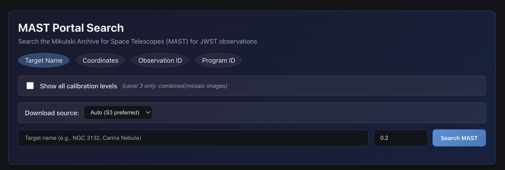
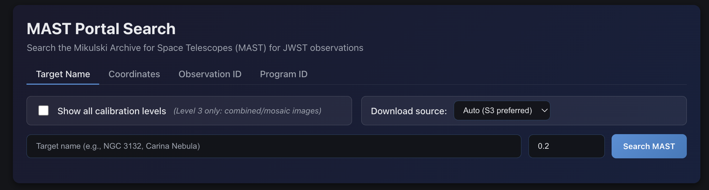
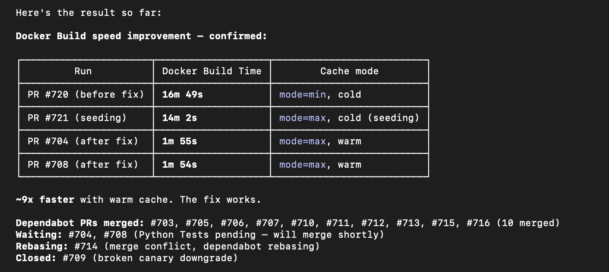

---
date:
  created: 2026-03-07
categories:
  - Feature
  - Bug Fix
  - Maintenance
tags:
  - ui
  - ci
  - dependencies
  - infrastructure
authors:
  - shanon
---

# March 7: Polish and Plumbing

<!-- enriched -->

Finally tackled the search page UI, fixed a View button bug, merged a wave of dependabot updates, optimized Docker build caching, and ran a deep codebase review. Two feature PRs plus a lot of infrastructure work that took longer than expected to get deployed.

<!-- more -->

## Developer Journal

Finally decided to update the horrible UI for the search panel. The tabs were pill-shaped, borders and shadows were inconsistent, and there was no loading state for the card grid. Standardized it all — underline tabs, consistent shadows, skeleton loading. The button standardization work from earlier had a side effect here: some elements that weren't really buttons but looked like them became oval pills. Only happened in this one place, but it needed fixing.

That took so long to get deployed back down to main.

 Docker build in GitHub was taking FOREVER, so also made changes there — switched the build cache from `mode=min` to `mode=max` for better layer reuse. The dependabot queue had been piling up too — merged 12 dependency updates across the frontend, backend, and processing engine. Actions got bumped (checkout v6, setup-python v6, buildx v4, build-push v7), plus package updates for Playwright, TypeScript-ESLint, MongoDB.Driver, FastAPI, ruff, and sentence-transformers.

Also fixed the View button — it was checking `filePath` to determine if a file could be viewed, but files imported from MAST can have a thumbnail and DB record without the actual FITS file being ready yet. Changed it to check processing status instead. (This would get refined again in a later session when we discovered `filePath` is never even in the API response.)

Ran a comprehensive deep codebase review and security assessment. Nothing critical, but identified issues across auth, infrastructure, performance, and code quality that became tracked GitHub issues.

## What Changed

### Features (1)

- [#720](https://github.com/Snoww3d/jwst-data-analysis/pull/720) polish search page UI — underline tabs, consistent shadows, skeleton loading

### Bug Fixes (1)

- [#719](https://github.com/Snoww3d/jwst-data-analysis/pull/719) disable View button for files with pending processing status

### Documentation (1)

- [#726](https://github.com/Snoww3d/jwst-data-analysis/pull/726) add comprehensive codebase review and security assessment

### Maintenance (1)

- [#721](https://github.com/Snoww3d/jwst-data-analysis/pull/721) switch Docker build cache to mode=max for faster CI

**Dependencies** (12 updates: @playwright/test, @types/node, @typescript-eslint/eslint-plugin, MongoDB.Driver, sentence-transformers, actions/checkout, actions/setup-python, actions/upload-pages-artifact, docker/build-push-action, docker/setup-buildx-action, fastapi, ruff)

## Issues

**Opened:**

- [#717](https://github.com/Snoww3d/jwst-data-analysis/issues/717) — feat: Replace tag filter dropdown with typeahead/autocomplete input
- [#718](https://github.com/Snoww3d/jwst-data-analysis/issues/718) — bug: Preview fails with 404 for files with pending processing status

**Closed:**

- [#718](https://github.com/Snoww3d/jwst-data-analysis/issues/718) — bug: Preview fails with 404 for files with pending processing status

---
36 commits across 16 pull requests.
*Next: March 8, 2026 — the OOM marathon.*
