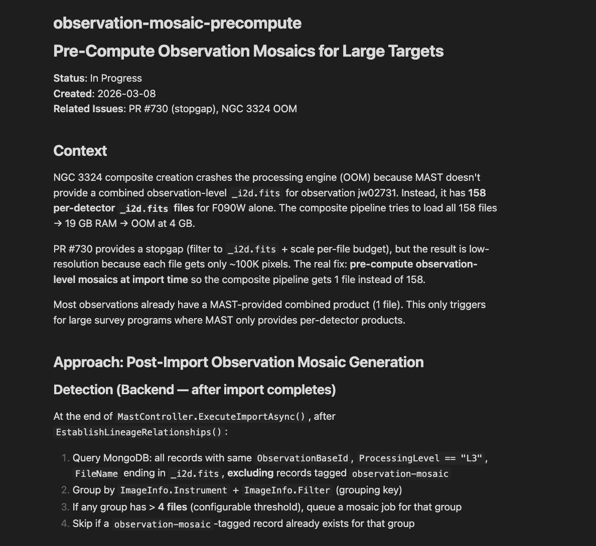
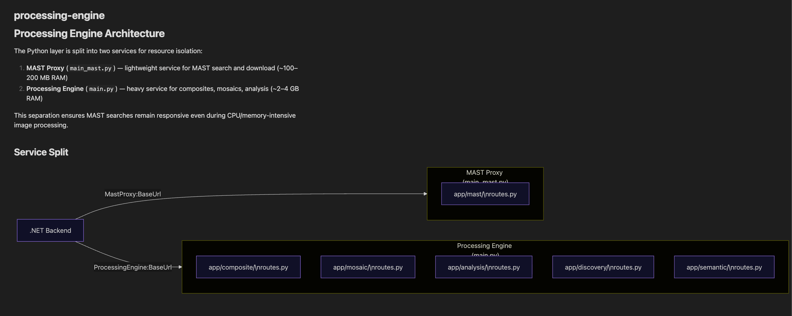
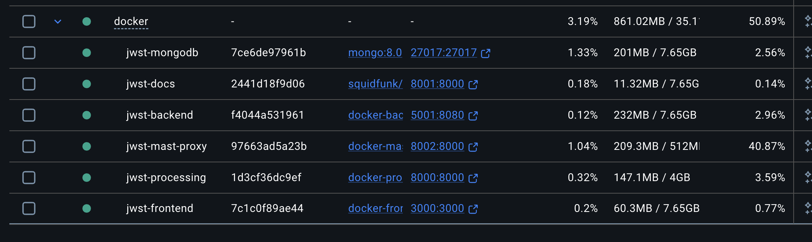

---
date:
  created: 2026-03-08
categories:
  - Feature
  - Bug Fix
  - Documentation
  - Maintenance
tags:
  - astronomy-data
  - ci
  - code-quality
  - dependencies
  - docs
  - e2e-tests
  - guided-wizard
  - imaging
  - infrastructure
  - mast-data
  - performance
  - security
authors:
  - shanon
---

# March 8: The OOM Marathon

<!-- enriched -->

The biggest day yet: 26 pull requests merged — OOM crashes, architecture splits, mosaic pre-computation, composite quality fixes, toast notifications, E2E repairs, a codebase security audit, and a side-by-side comparison that's finally getting closer to NASA. A marathon driven by one target that refused to cooperate.

<!-- more -->

## Developer Journal

Thought the discovery flow had edge cases handled. It did not.

Started the morning trying to composite a target that needed 158 FITS files for its mosaic. The largest successful mosaic so far was about 80 files — 158 is double that. The processing engine got OOM-killed before it could even log the error. Sad trombone. Claude's thinking trace was telling: "The Python endpoint already has comprehensive logging. The issue is that the process gets OOM-killed before it can log the error."

So the day became about resilience. Added memory monitoring to the processing engine so we can actually see what's happening before things explode. Then fixed the OOM itself by filtering to only the files needed for the active recipe and scaling memory limits based on input size. Added retry policies and user-friendly error messages so when things do fail, users get something actionable instead of a silent hang.

The bigger architectural change: had to split the MAST proxy out of the processing engine into its own lightweight Docker service. The processing engine was being monopolized by the heavy math — mosaicking, compositing, analysis — and that blocked simple operations like searching and downloading FITS files. Having a smaller instance dedicated to MAST operations allows for better scaling anyway. But yeah, another Docker container to manage, upping the architecture complexity.

Pre-computed observation mosaics for large targets so the heavy work happens in the background after import, not when the user tries to create a composite. Added an inline mosaic fallback for the race condition where someone tries to composite before the background job finishes.

The composite quality work paid off.

*3-channel NIRCam-only composite — dramatically better with robust normalization and zscale* The 3-channel NIRCam-only version using the discovery wizard looked dramatically better with robust normalization and zscale replacing the old min/max approach. 
*6-channel version — used 630 FITS files*

Then ran a 6-channel version — still improvements to be made, but for reference, it used 630 FITS files for that composite. 
*NASA's version for comparison*

Posted the NASA version side by side. The reaction: star-struck emoji.

Replaced all `alert()` and `window.confirm()` calls with toast notifications. Fixed E2E test failures that broke after recent changes. Scoped filter presets to the active target so switching targets doesn't show stale presets. Ran and validated a comprehensive codebase review with security assessment, then tracked all findings as GitHub issues in the development plan.

## What Changed

### Features (5)

- [#729](https://github.com/Snoww3d/jwst-data-analysis/pull/729) add memory monitoring to processing engine for OOM debugging
- [#732](https://github.com/Snoww3d/jwst-data-analysis/pull/732) pre-compute observation mosaics for large targets
- [#734](https://github.com/Snoww3d/jwst-data-analysis/pull/734) extract MAST proxy into separate lightweight service
- [#738](https://github.com/Snoww3d/jwst-data-analysis/pull/738) replace all alert() calls with toast notifications
- [#753](https://github.com/Snoww3d/jwst-data-analysis/pull/753) inline observation mosaic fallback for composite pipeline

### Bug Fixes (5)

- [#722](https://github.com/Snoww3d/jwst-data-analysis/pull/722) scope JWST filter presets to active target
- [#727](https://github.com/Snoww3d/jwst-data-analysis/pull/727) add retry policies and user-friendly errors for processing engine
- [#730](https://github.com/Snoww3d/jwst-data-analysis/pull/730) prevent OOM on large composite requests by filtering files and scaling memory
- [#735](https://github.com/Snoww3d/jwst-data-analysis/pull/735) use robust normalization and zscale for guided create composites
- [#737](https://github.com/Snoww3d/jwst-data-analysis/pull/737) resolve E2E test failures in guided-create and mast-download suites

### Documentation (3)

- [#726](https://github.com/Snoww3d/jwst-data-analysis/pull/726) add comprehensive codebase review and security assessment
- [#739](https://github.com/Snoww3d/jwst-data-analysis/pull/739) add validated codebase review and security assessment
- [#752](https://github.com/Snoww3d/jwst-data-analysis/pull/752) add codebase review issues to development plan

### Maintenance (1)

- [#721](https://github.com/Snoww3d/jwst-data-analysis/pull/721) switch Docker build cache to mode=max for faster CI

**Dependencies** (12 updates: @playwright/test, @types/node, @typescript-eslint/eslint-plugin, MongoDB.Driver, sentence-transformers, actions/checkout, actions/setup-python, actions/upload-pages-artifact, docker/build-push-action, docker/setup-buildx-action, fastapi, ruff)

## Issues

**Opened:**

- [#723](https://github.com/Snoww3d/jwst-data-analysis/issues/723) — fix: auth token expires mid-session, kicks user to login page
- [#724](https://github.com/Snoww3d/jwst-data-analysis/issues/724) — fix: 4K composite export fails — processing engine response ends prematurely
- [#728](https://github.com/Snoww3d/jwst-data-analysis/issues/728) — Processing engine crashes silently on large composite requests (OOM)
- [#731](https://github.com/Snoww3d/jwst-data-analysis/issues/731) — feat: Background job queue dashboard
- [#736](https://github.com/Snoww3d/jwst-data-analysis/issues/736) — feat: auto-detect optimal stretch parameters per composite
- [#740](https://github.com/Snoww3d/jwst-data-analysis/issues/740) — perf: blocking fits.open() in async Python handlers starves event loop
- [#741](https://github.com/Snoww3d/jwst-data-analysis/issues/741) — security: add security headers middleware to .NET gateway
- [#742](https://github.com/Snoww3d/jwst-data-analysis/issues/742) — security: add secret scanning (gitleaks) to CI and pre-commit
- [#743](https://github.com/Snoww3d/jwst-data-analysis/issues/743) — security: add rate limiting to auth endpoints
- [#744](https://github.com/Snoww3d/jwst-data-analysis/issues/744) — security: add password complexity requirements
- [#745](https://github.com/Snoww3d/jwst-data-analysis/issues/745) — security: add Docker container resource limits (CPU/memory)
- [#746](https://github.com/Snoww3d/jwst-data-analysis/issues/746) — security: add startup configuration validation in .NET gateway
- [#747](https://github.com/Snoww3d/jwst-data-analysis/issues/747) — refactor: decompose oversized React components (ImageViewer, MastSearch)
- [#748](https://github.com/Snoww3d/jwst-data-analysis/issues/748) — refactor: split monolithic main.py into route modules
- [#749](https://github.com/Snoww3d/jwst-data-analysis/issues/749) — refactor: replace broad catch(Exception) with specific types in .NET
- [#750](https://github.com/Snoww3d/jwst-data-analysis/issues/750) — perf: add code splitting with React.lazy for page routes
- [#751](https://github.com/Snoww3d/jwst-data-analysis/issues/751) — bug: background estimation in analysis route has no timeout

**Closed:**

- [#668](https://github.com/Snoww3d/jwst-data-analysis/issues/668) — fix: replace all alert() calls with toast notifications
- [#724](https://github.com/Snoww3d/jwst-data-analysis/issues/724) — fix: 4K composite export fails — processing engine response ends prematurely
- [#728](https://github.com/Snoww3d/jwst-data-analysis/issues/728) — Processing engine crashes silently on large composite requests (OOM)
- [#731](https://github.com/Snoww3d/jwst-data-analysis/issues/731) — feat: Background job queue dashboard

---
50 commits across 26 pull requests.
*Next: March 9, 2026 — deep field backgrounds and bug fixing.*
