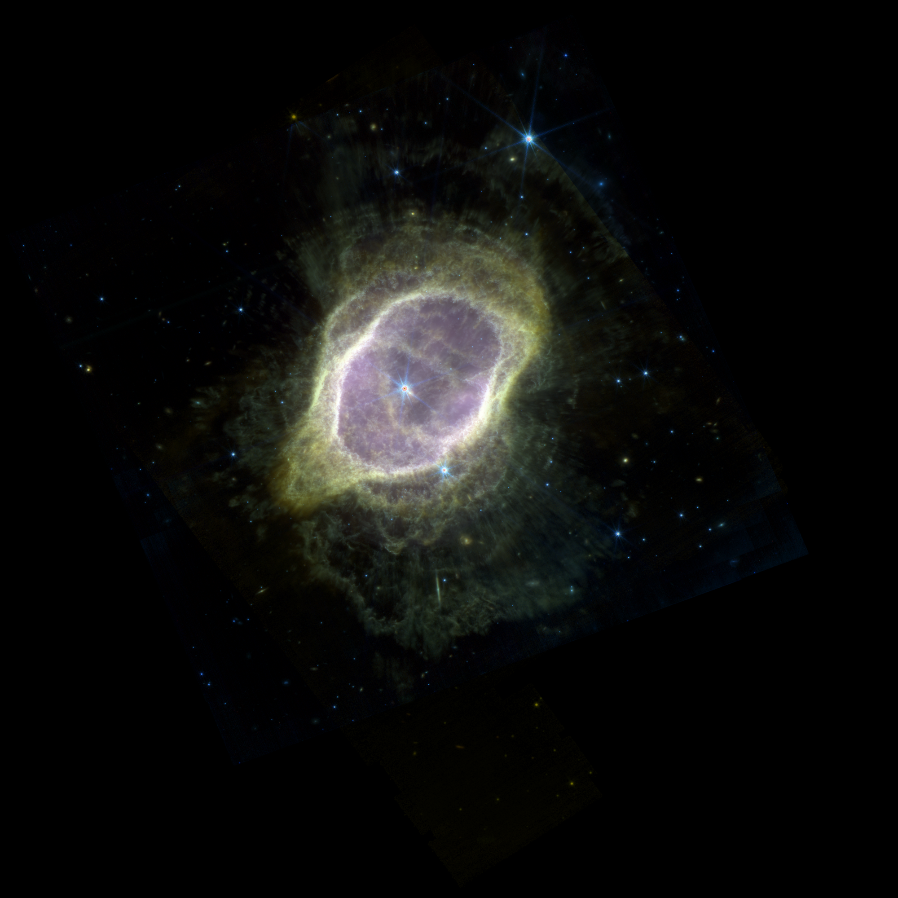
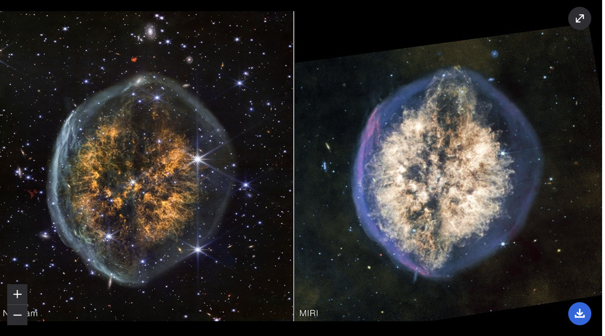
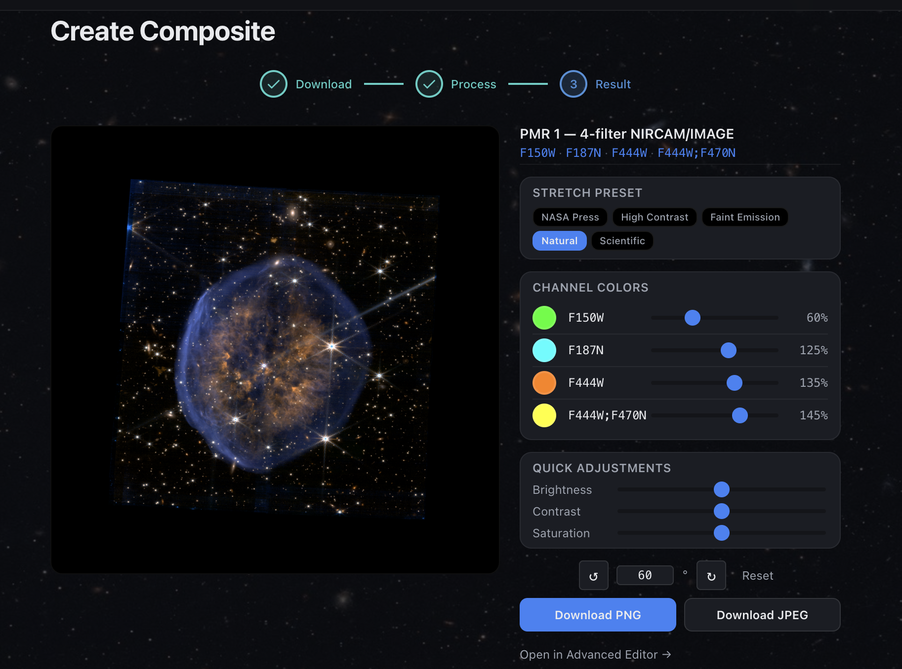
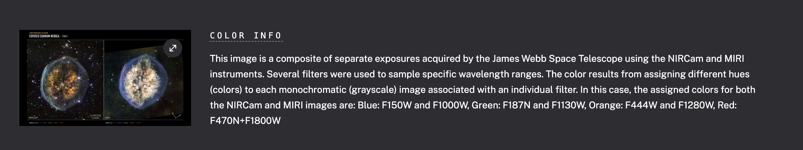
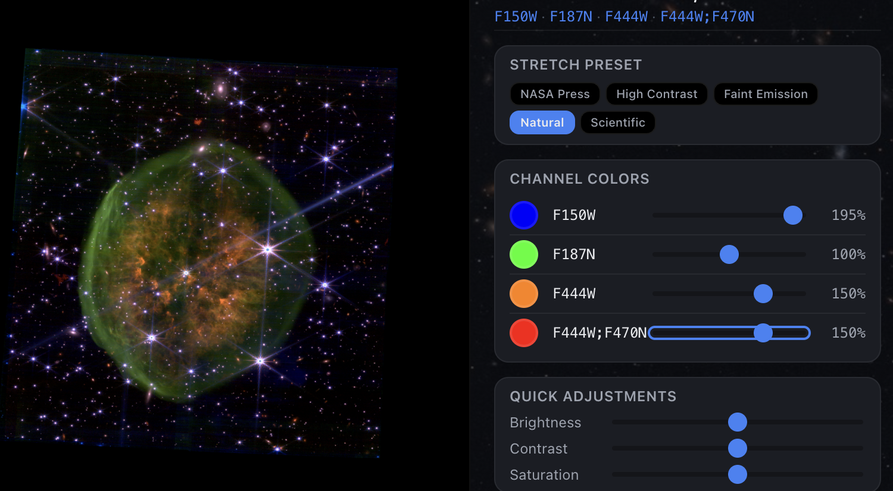
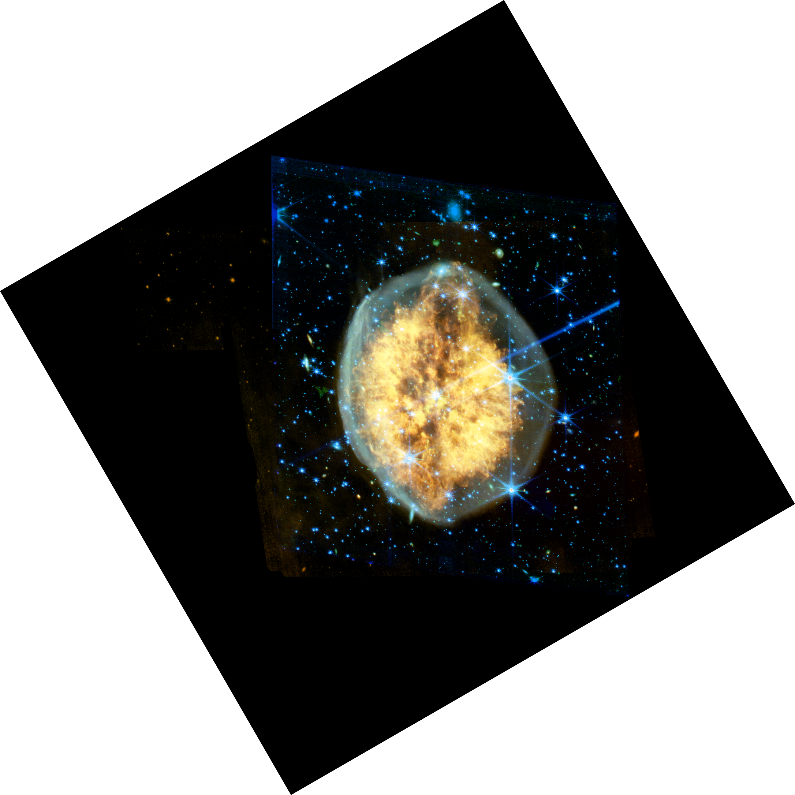

---
date:
  created: 2026-03-10
categories:
  - Bug Fix
  - Performance
  - Compositing
tags:
  - composite-processing
  - auto-crop
  - ci
  - api-client
  - recipes
authors:
  - shanon
---

# March 10: Auto-Crop, Color Theory Humility, and Killing Dead Weight

Seven PRs shipped — most of them fixing things that were silently wrong. Auto-crop removes the black borders that made every composite look like a padded square. Recipes now filter out non-science observations. And the composite pipeline finally routes through the authenticated API client like everything else should have from the start.

<!-- more -->

## Developer Journal

### Auto-cropping the black void

Every composite was rendering as a 2000×2000 square padded with black because the preview canvas is always square. The actual content — a nebula, a galaxy — sits somewhere inside that square, surrounded by nothing. Auto-crop (#773) detects the content bounds and trims the padding. The Southern Ring Nebula goes from a black square with a small nebula in the middle to a properly framed image.

### The color theory gap

Spent time comparing composites against NASA press releases. The colors are sometimes completely different — cool blues and greens for NIRCam, warm reds for MIRI seems to be the NASA convention, but they don't always follow it. Tried reproducing a planetary nebula and couldn't figure out how they picked their channel-to-color mapping.

The green problem keeps coming back. Where NASA gets a delicate light blue, I get swamp green. This is a color mapping issue, not a processing issue — the underlying data is the same. Something to revisit when per-channel adjustments land.

### Export rotation: noticed but not fixed

Rotation and export framing still don't agree. The preview shows one thing, the export produces another. Noted the issue — this becomes #788 and gets fixed on March 12.

### Everything else

Background estimation in source detection could hang forever on certain fields — added a 60-second timeout (#774). Composite and mosaic API calls were bypassing the authenticated API client, so token refresh and 401 retry weren't happening — routed them through `apiClient` (#775). CI broke because .NET 10 SDK had a download URL change — pinned to 10.0.200 (#776). Recipe generation was including non-science observations (calibration data, engineering frames) — filtered them out (#778). And the blocking async handlers in the processing pipeline were wasting thread pool threads — converted to sync (#771).

## What shipped

| PR | Title |
|-----|-------|
| #771 | perf: convert blocking async handlers to sync for thread-pool execution |
| #772 | docs: add dashboard screenshot for README |
| #773 | fix: auto-crop black borders from composite images |
| #774 | fix: add 60s timeout to background estimation in source detection |
| #775 | fix: route composite/mosaic services through apiClient for token refresh |
| #776 | ci: pin .NET SDK to 10.0.200 to fix CI download failure |
| #778 | fix: filter non-science observations from recipe generation |
