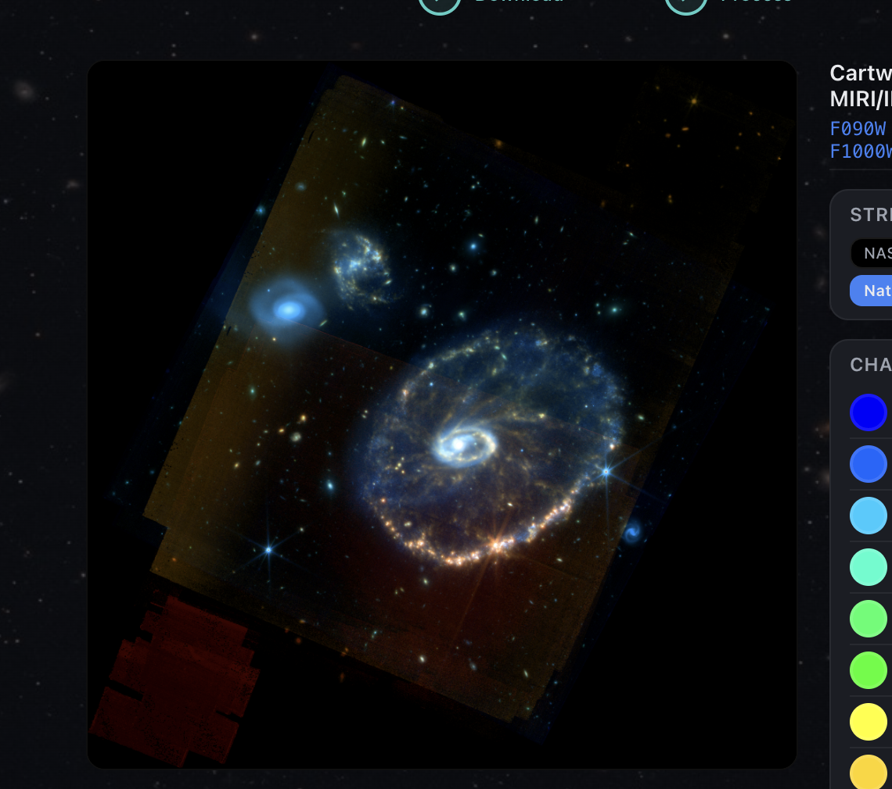
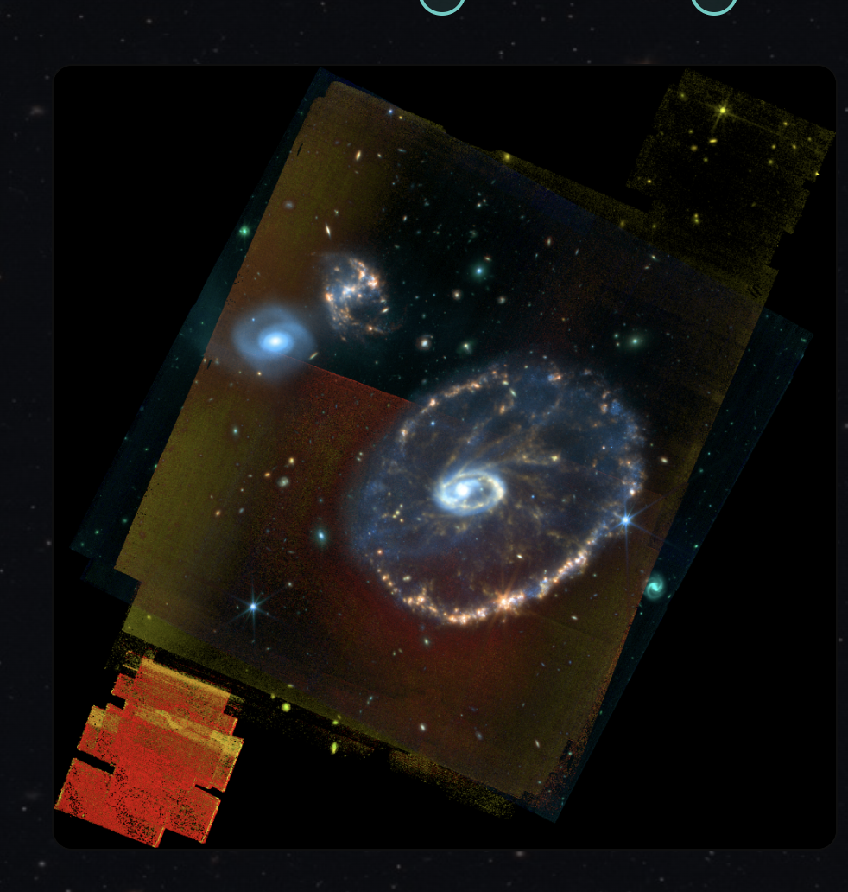
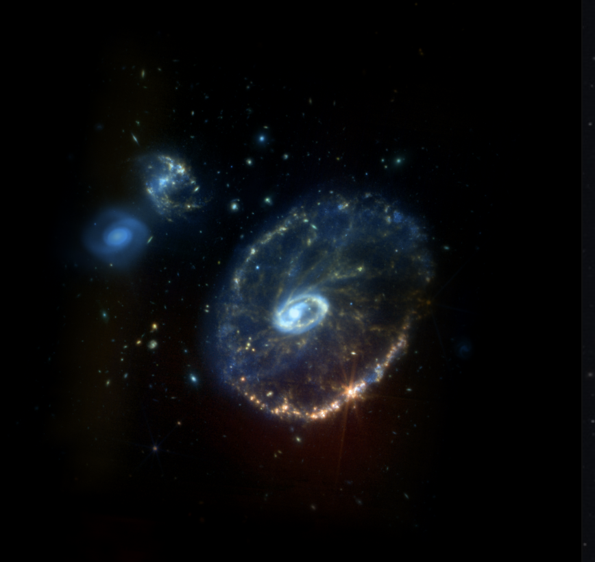
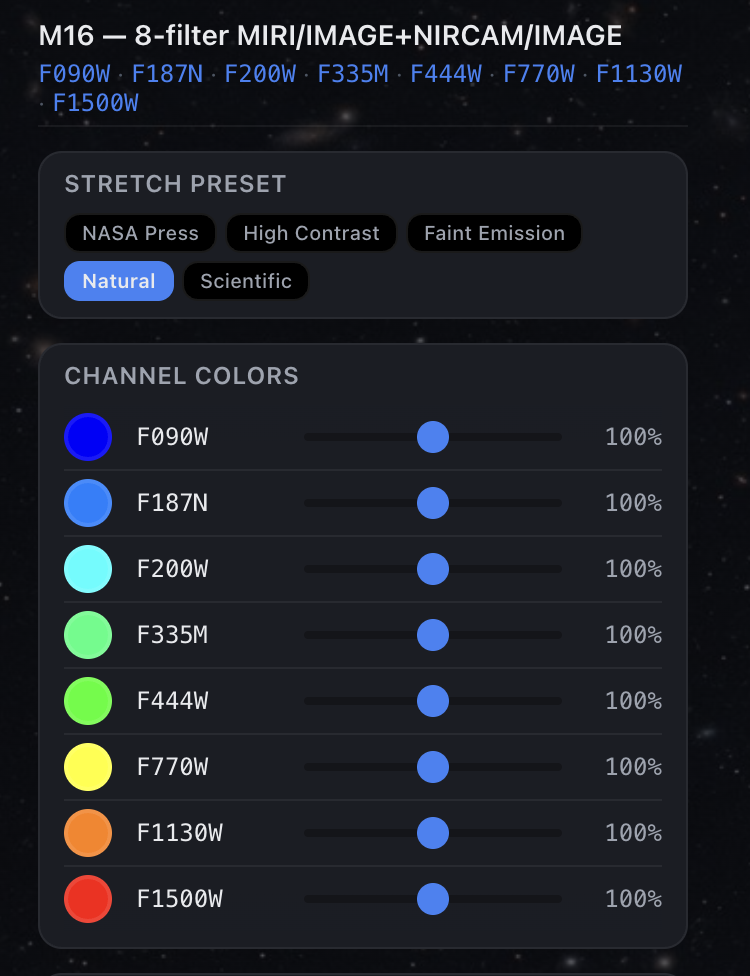
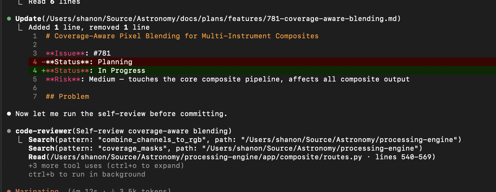

---
date:
  created: 2026-03-11
categories:
  - Feature
  - Bug Fix
  - Compositing
tags:
  - composite-processing
  - edge-feathering
  - pixel-blending
  - export
  - recipes
  - ui
authors:
  - shanon
---

# March 11: Blending Boundaries and the 13-Channel Cartwheel

Ten PRs. The headline features: coverage-aware pixel blending eliminates the hard edges where different instruments overlap, edge feathering smooths the FOV boundaries, and wallpaper-ready export adds rotation and resolution presets. Also shipped curated NASA-style recipes for famous targets, and rebuilt the Result step layout.

<!-- more -->

## Developer Journal

### Coverage-aware pixel blending

The biggest problem with multi-instrument composites was the hard boundaries where detector fields of view overlap. Where NIRCam and MIRI coverage overlaps, pixels were being naively averaged — or worse, one instrument just won. Coverage-aware blending (#782) weights each pixel by how many instruments contributed to it, producing smooth transitions instead of visible seams.

The 13-channel composite of the Cartwheel Galaxy was the test case — NIRCam and MIRI combined across all available filters.

### Edge feathering: attempt one was an "adjective failure"

Coverage-aware blending handled the overlap regions, but the outer edges of each instrument's field of view still had hard cutoffs — stars and nebulosity just stopped at the detector boundary. Edge feathering (#784) adds a smooth falloff at FOV boundaries so content fades to black instead of cutting off.

First attempt didn't go well.

But feathering made a huge difference on the second pass. Not perfect — you lose some stars and galaxies near the edges — but so much better than hard cutoffs. Added a slider for manual adjustment since the ideal balance depends on the target. Default is 15%, which works for most cases.

Found a bug during testing: edge feathering was being computed per-FITS-file instead of per-wavelength-layer. Cool-looking bug — it created a mosaic-within-a-mosaic effect — but still a bug. Fixed in #787 to compute from the composite boundary instead.

### Eight channels of Pillars

Pushed the channel count higher with the Pillars of Creation — 8 filters across both NIRCam and MIRI. "Very rainbow composite" is accurate. The default color mapping produces something psychedelic when you throw 8 wavelengths at it, but the underlying data alignment is solid.

### The $12 code review

Ran the rebuilt compliance-check skill on a PR. The whole thing — lint, format, unit tests, security review — takes about a minute and costs roughly the price of the Claude Pro subscription you're already paying for. Not the $12–15 per PR that some enterprise tools charge.

### Wallpaper-ready export

Added server-side rotation and resolution presets to the export pipeline (#786). You can now pick 4K Desktop, Mobile, Ultrawide, etc. and the server renders at the correct resolution with rotation applied. The preview framing panel shows what you'll get — though as we discovered on March 12, the preview was lying about the framing.

### Result step and UI polish

Rebuilt the Result step layout (#789) — compact header, scrollable sidebar, portal-based color picker so it doesn't get clipped by overflow. Added scroll shadows to the channel colors list (#785) so you can tell there's more content below when you have 8+ channels.

### Southern Ring at 4K

End of day reward — the Southern Ring Nebula exported at 3840×2160. The gas shells, the central binary star, the diffraction spikes. This is why I'm building this thing.

## What shipped

| PR | Title |
|-----|-------|
| #779 | fix: bump recipe cache version to invalidate stale non-science recipes |
| #780 | fix: verify FITS files exist on disk in availability check |
| #782 | feat: coverage-aware pixel blending for multi-instrument composites |
| #784 | feat: edge feathering for multi-instrument FOV boundaries |
| #785 | fix: add scroll shadows to channel colors list for overflow indication |
| #786 | feat: wallpaper-ready export with server-side rotation and resolution presets |
| #787 | fix: compute feather mask from composite boundary instead of per-channel |
| #789 | fix: improve Result step layout — compact header, scrollable sidebar, portal color picker |
| #791 | feat: curated NASA-style recipes for famous JWST images |
| #792 | fix: update E2E test selectors to match current component structure |
