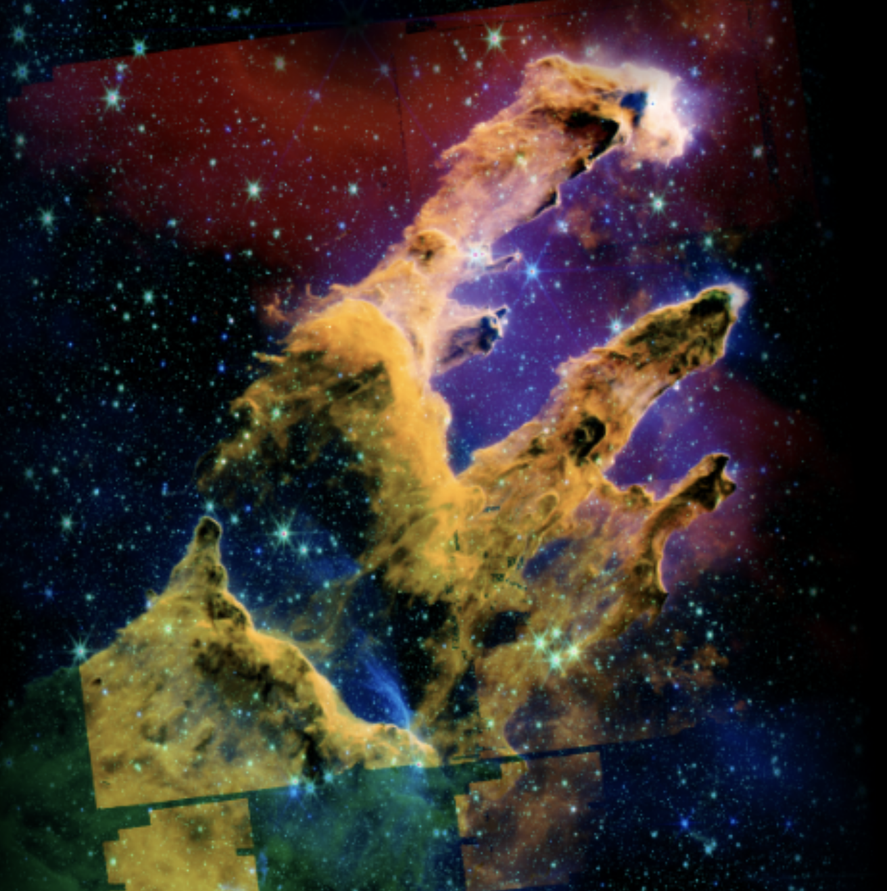
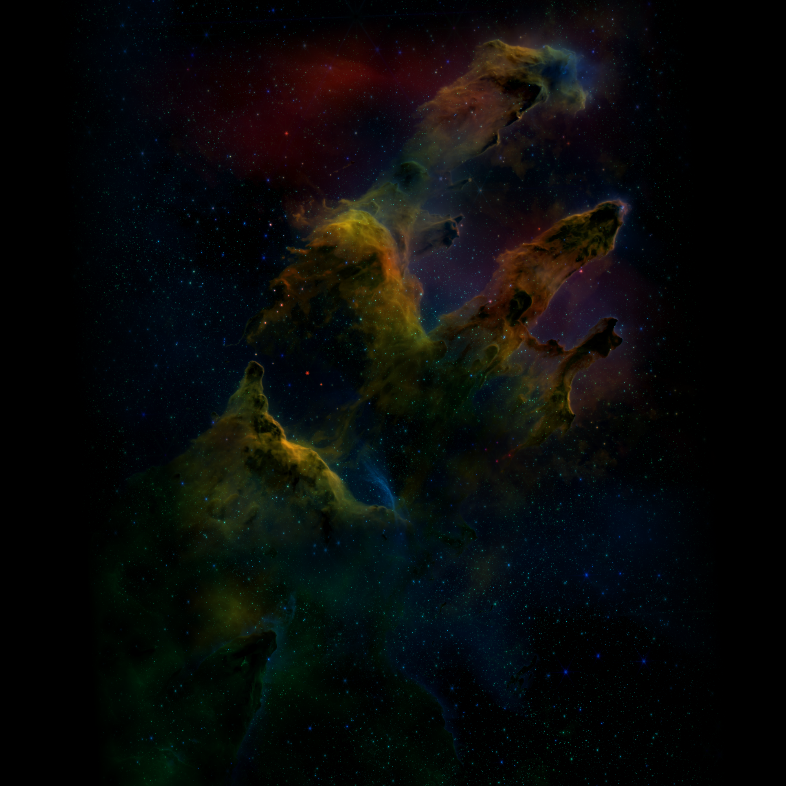

---
date:
  created: 2026-03-12
categories:
  - Bug Fix
  - Testing
  - Tooling
tags:
  - e2e-tests
  - composite-processing
  - developer-experience
  - export
authors:
  - shanon
---

# March 12: Ghost Tests and Coordinate Lies

Two bugs that had been quietly undermining trust in different parts of the system — 18 E2E tests silently skipping, and an export framing preview that was lying about what you'd get. Plus: the compliance-check skill got a ground-up rewrite.

<!-- more -->

## Developer Journal

### The 18 invisible skips

Noticed that 18 E2E viewer tests were silently skipping with "No viewable data available." Not failing — *skipping*. Green CI, zero signal that anything was wrong.

Dug into it. The `openImageViewer()` helper searches for `.data-card` elements containing the test file's name. But the default dashboard view is Lineage, which renders `.lineage-file-card` elements inside collapsible processing levels. Those levels start collapsed — meaning the file card elements aren't in the DOM at all. The helper was searching for elements that literally didn't exist.

The fix: always switch to the "By Target" view before searching, which renders flat `.data-card` elements for all files. Went from 7 passing / 18 skipped to 135 passing / 0 skipped. The 5 remaining failures are preview-generation timeouts — the processing engine sometimes needs more than 30 seconds, which is a separate performance issue.

The insidious part: these tests were *designed* to skip gracefully when data wasn't viewable. That safety net became a hiding place for a real bug. A test that can never fail is worse than no test at all — it gives false confidence.

### Export framing: the coordinate space lie

The export framing panel lets you pick a wallpaper preset (4K, Mobile, etc.), zoom/pan to frame your composite, then export. The preview showed the Pillars of Creation beautifully centered at 2.1x zoom on Mobile (1080x1920). The exported image showed... the bottom-left corner of the nebula. Completely different framing.

First attempt at a fix: improved the content detection threshold and resolution. Didn't help — the mismatch was too large for a threshold issue.

The real problem was a coordinate space mismatch. The preview canvas computed zoom and pan relative to the 2000x2000 preview image (square, padded with black). The server computed them relative to the auto-cropped content (not square, no padding). Same `crop_zoom=2.1` and `crop_center=0.5` — completely different result in each reference frame.

The fix: detect the content bounds within the preview (matching the server's `_auto_crop`), then use those content dimensions in `drawCanvas` for all the framing math. Now the client draws only the content region from the preview, and the `baseScale` / offset calculations match the server exactly. Preview and export agree.

### Compliance check skill rewrite

Rebuilt the compliance-check slash command as a proper Claude Code skill with YAML frontmatter and tiered execution:

- **Quick** (Tier 1): lint + format only — takes ~15 seconds
- **Standard** (Tiers 1+2): adds unit tests — the default
- **Full** (Tiers 1+2+3): adds coverage analysis, E2E, bundle size, staging verification, docs audit

Added tier gating (stop on failure before advancing), stale branch detection, merged-PR handling, and `allowed-tools` frontmatter so the skill auto-approves Docker/npm/gh commands. Ran two eval iterations to validate accuracy and speed improvements.

### CA1873 lint fix

Found during the compliance check: `DiscoveryController.cs` had a string interpolation inside a `LoggerMessage` source-generator call, which defeats the lazy evaluation that makes `LoggerMessage` fast. Extracted to a local variable. Small fix, correct fix.

## What shipped

| PR | Title |
|-----|-------|
| #793 | fix: resolve CA1873 lint warning in DiscoveryController |
| #794 | fix: switch to By Target view in openImageViewer to fix 18 E2E skips |
| #795 | fix: match server content detection in export framing preview |
